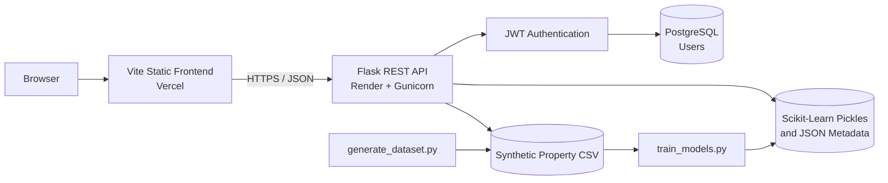

<div align="center">

#  Urban Real Estate Intelligence

### Property valuation analytics across metro micro-markets using PCA and ensemble regression

[](https://www.python.org/)
[](https://flask.palletsprojects.com/)
[](https://scikit-learn.org/)
[](https://www.postgresql.org/)
[](https://vite.dev/)
[](https://render.com/)
[](https://vercel.com/)
[](#-license)

[Live Dashboard](https://urei-chi.vercel.app) · [Live API](https://hcl-project-89ks.onrender.com/api/health) · [Repository](https://github.com/amanv1415/HCL-Project)

</div>

---

## 📖 Project Overview

**Urban Real Estate Intelligence (UREI)** is a full-stack machine learning application for exploring property-market patterns and estimating property valuations across five metropolitan micro-markets.

The project combines:

- A responsive analytics dashboard with market, sector, PCA, and model-performance visualizations
- An interactive property valuation predictor backed by a stacking ensemble
- A spatial canvas map for exploring and selecting properties
- A Flask REST API that serves datasets, ML metadata, predictions, and authentication
- PostgreSQL user storage with JWT-based authentication
- A reproducible synthetic dataset generator and Scikit-Learn training pipeline
- Split production deployment using Vercel for the frontend and Render for the API/database

> **Data notice:** The included property data is synthetic and intended for demonstration, education, and model experimentation. It should not be used for real investment or valuation decisions.

## ✨ Key Features

- 📊 **Market dashboard** with property counts, valuation summaries, and market/sector distributions
- 🔬 **PCA analysis** with explained variance and component-importance visualizations
- 🤖 **Ensemble model comparison** using R², RMSE, MAE, and actual-vs-predicted charts
- 💰 **Property valuation API and UI** powered by a stacking regression ensemble
- 🗺️ **Interactive micro-market map** with filters, heatmap colors, property tooltips, and predictor synchronization
- 🔎 **Dashboard search** across sections, markets, sectors, models, and sampled properties
- 🔐 **Authentication system** with registration, login, password hashing, JWT access tokens, and remembered sessions
- 🌐 **CORS-aware split deployment** for independently hosted frontend and backend services
- 🗃️ **PostgreSQL persistence** in production with SQLite fallback for local development
- ⚙️ **Reproducible ML pipeline** for dataset generation, preprocessing, training, evaluation, and artifact export

## 🏗️ System Architecture



### Runtime Flow

1. The Vite frontend requests summary, PCA, model, prediction, map, and authentication data from the Flask API.
2. The Flask application lazily loads trained Scikit-Learn artifacts and JSON metadata from `models/`.
3. Prediction requests are encoded, transformed with the saved `StandardScaler`, and passed to the stacking ensemble.
4. Authentication requests store or query users through SQLAlchemy and return signed HS256 JWT tokens.
5. PostgreSQL is used on Render; local development defaults to SQLite when `DATABASE_URL` is not set.

## 🧰 Tech Stack

| Layer | Technologies |
|---|---|
| Frontend | HTML5, CSS3, JavaScript ES Modules, Vite, Chart.js |
| Backend | Python, Flask, Flask-CORS, Gunicorn |
| API | REST-style JSON endpoints and Flask Blueprints |
| Machine Learning | Scikit-Learn, Pandas, NumPy, Pickle |
| Models | Random Forest, Gradient Boosting, AdaBoost, Stacking Regressor, Ridge |
| Dimensionality Reduction | StandardScaler and Principal Component Analysis |
| Authentication | PyJWT, Werkzeug password hashing, Flask-Login user model integration |
| Database | PostgreSQL, Flask-SQLAlchemy, Flask-Migrate/Alembic; SQLite local fallback |
| Deployment | Vercel frontend, Render backend and PostgreSQL |

## 📁 Folder Structure

```text
real_estate_project/
├── app.py                         # Flask application factory and error handlers
├── config.py                      # Environment, database, CORS, and auth configuration
├── extensions.py                  # SQLAlchemy, Migrate, and LoginManager instances
├── wsgi.py                        # Gunicorn production entry point
├── routes/
│   ├── api.py                     # ML, dataset, health, and prediction endpoints
│   ├── auth_api.py                # Register, login, current-user, and logout endpoints
│   └── main.py                    # Root and dashboard redirects
├── models/
│   ├── user.py                    # SQLAlchemy User model
│   ├── *.pkl                      # Generated models, scaler, PCA, and label encoders
│   ├── metrics.json               # Model evaluation metrics
│   ├── pca_data.json              # PCA metadata and loadings
│   ├── dataset_summary.json       # Dataset statistics for the dashboard
│   └── predictions_sample.json    # Actual vs predicted chart sample
├── utils/
│   └── auth_tokens.py             # JWT creation and decoding
├── migrations/                    # Alembic database migration configuration
├── frontend/
│   ├── index.html                 # Main analytics dashboard
│   ├── login.html                 # Login page
│   ├── register.html              # Registration page
│   ├── js/                        # API client, auth, charts, map, and predictor logic
│   ├── css/styles.css             # Responsive application styles
│   ├── vite.config.js             # Multi-page Vite build
│   └── vercel.json                # Vercel build, rewrites, and security headers
├── generate_dataset.py            # Synthetic property dataset generator
├── train_models.py                # Preprocessing, PCA, training, and evaluation pipeline
├── real_estate_dataset.csv        # Generated 10,000-property dataset
├── requirements.txt               # Python dependencies
├── render.yaml                    # Render API and PostgreSQL blueprint
└── DEPLOYMENT.md                  # Additional deployment notes
```

## 🤖✅  Machine Learning Models Used

The training pipeline uses an 80/20 train/test split with `random_state=42`. Categorical market and sector fields are label-encoded, and all 21 model features are standardized before training.

| Model | Configuration Summary | R² | RMSE | MAE |
|---|---|---:|---:|---:|
| Random Forest | 200 trees, max depth 15 | 0.9406 | 46,291.74 | 29,240.82 |
| Gradient Boosting | 200 estimators, max depth 6, learning rate 0.1 | 0.9472 | 43,627.39 | 25,953.03 |
| AdaBoost | 150 estimators, learning rate 0.05 | 0.7794 | 89,216.45 | 65,922.83 |
| **Stacking Ensemble** | Random Forest + Gradient Boosting + AdaBoost; Ridge meta-model; 5-fold CV | **0.9483** | **43,192.89** | **25,687.91** |

The **Stacking Ensemble** is selected as the best-performing model and is used by `POST /api/predict`.

### Generated ML Artifacts

Running `python train_models.py` creates:

- `random_forest.pkl`
- `gradient_boosting.pkl`
- `adaboost.pkl`
- `stacking_ensemble.pkl`
- `scaler.pkl`
- `pca.pkl`
- `le_market.pkl`
- `le_sector.pkl`
- `metrics.json`
- `pca_data.json`
- `dataset_summary.json`
- `predictions_sample.json`

## 🗂️ Dataset Information

The included dataset is generated by `generate_dataset.py` with a fixed NumPy seed for reproducibility.

| Property | Value |
|---|---|
| Dataset type | Synthetic residential property data |
| Records | 10,000 |
| Raw columns | 23 |
| Model features | 21 |
| Target | `valuation_eur` |
| Micro-markets | Center, South, East, West, North |
| Housing sectors | Social Rental, Private Rental, Home Ownership |
| Geographic inspiration | Amsterdam/Dutch metropolitan layout |
| Generation inspiration | NetLogo housing-market parameters |

The generated features cover coordinates, distance to center, room count, floor area, quality, building age, amenities, tax rate, income zone, transit, green space, crime, schools, noise, energy efficiency, parking, balcony access, renovation year, market, and sector.

### Dataset Summary

- Mean valuation: `436,820.42`
- Median valuation: `384,500.00`
- Minimum valuation: `115,500.00`
- Maximum valuation: `1,955,200.00`
- Standard deviation: `198,879.37`

> The target column is named `valuation_eur`, while the current dashboard and API-formatted prediction display use the `₹` symbol.

## 🔬 PCA Implementation

The training pipeline standardizes the feature matrix with `StandardScaler`, fits a full PCA analysis, and selects the smallest number of components that retain at least 95% cumulative variance.

| PCA Metric | Result |
|---|---:|
| Original feature dimensions | 21 |
| Selected principal components | 16 |
| Variance retained | 96.42% |
| Dimensionality reduction | 23.81% |

PCA loadings, explained variance ratios, cumulative variance, and component importances are exported to `models/pca_data.json` for the dashboard.

> **Implementation detail:** PCA is currently used for analysis and visualization. The production regressors, including the stacking ensemble, are trained on the standardized original 21-feature matrix rather than the PCA-transformed matrix.

## 🔌 API Endpoints

Base production URL: `https://hcl-project-89ks.onrender.com`

### Application and ML API

| Method | Endpoint | Description |
|---|---|---|
| `GET` | `/` | Redirects to the configured frontend or returns API service information |
| `GET` | `/dashboard` | Redirects to the separately deployed frontend |
| `GET` | `/api/health` | Returns API health status |
| `GET` | `/api/summary` | Returns dataset summary statistics |
| `GET` | `/api/metrics` | Returns model evaluation metrics |
| `GET` | `/api/pca` | Returns PCA components, variance, loadings, and importances |
| `GET` | `/api/predictions` | Returns sampled actual and predicted values |
| `GET` | `/api/data?n=500` | Returns a deterministic random sample of property records |
| `POST` | `/api/predict` | Estimates a property valuation |

### Authentication API

| Method | Endpoint | Authentication | Description |
|---|---|---|---|
| `POST` | `/api/auth/register` | Public | Creates a user and returns a JWT |
| `POST` | `/api/auth/login` | Public | Verifies credentials and returns a JWT |
| `GET` | `/api/auth/me` | Bearer JWT | Returns the current user |
| `POST` | `/api/auth/logout` | Public | Returns a logout acknowledgement; the frontend removes the local token |

### Prediction Example

```bash
curl -X POST http://localhost:5000/api/predict \
  -H "Content-Type: application/json" \
  -d '{
    "micro_market": "Center",
    "sector": "Home Ownership",
    "latitude": 52.3700,
    "longitude": 4.8950,
    "rooms": 3,
    "floor_area_m2": 80,
    "quality_score": 0.7,
    "building_age_years": 20,
    "energy_label": 3,
    "transit_proximity_score": 0.7
  }'
```

Example response:

```json
{
  "valuation_eur": 723800.0,
  "formatted": "₹723,784",
  "confidence": "high"
}
```

### Authenticated Request Example

```bash
curl https://hcl-project-89ks.onrender.com/api/auth/me \
  -H "Authorization: Bearer <your-jwt-token>"
```

## 🗄️ Database Design

SQLAlchemy manages the application database, and Flask-Migrate/Alembic tracks schema changes.

### `users` Table

| Column | Type | Constraints / Purpose |
|---|---|---|
| `id` | Integer | Primary key |
| `username` | String(64) | Unique, required |
| `email` | String(120) | Unique, required |
| `password_hash` | String | Required; generated with Werkzeug |
| `created_at` | DateTime | Defaults to account creation time |
| `is_active` | Boolean | Controls account access |

Production uses the PostgreSQL instance declared in `render.yaml`. Local development falls back to `sqlite:///database.db`.

## 📦 Installation Guide

### Prerequisites

- Python 3.11+
- Node.js and npm
- PostgreSQL for a production-like setup, or SQLite for local development
- Git

### Clone the Repository

```bash
git clone https://github.com/amanv1415/HCL-Project.git
cd HCL-Project
```

### Install Backend Dependencies

```bash
python -m venv .venv
source .venv/bin/activate
python -m pip install --upgrade pip
pip install -r requirements.txt
```

On Windows PowerShell, activate the environment with:

```powershell
.\.venv\Scripts\Activate.ps1
```

### Install Frontend Dependencies

```bash
cd frontend
npm install
cd ..
```

## 🔐 Environment Variables

Create the backend environment file:

```bash
cp .env.example .env
```

For local development, set at least:

```dotenv
SECRET_KEY=replace-with-a-random-secret-at-least-32-bytes-long
FLASK_CONFIG=development
FLASK_APP=wsgi:app
DATABASE_URL=sqlite:///database.db
FRONTEND_URL=http://localhost:5173
AUTO_CREATE_DB=true
```

| Variable | Required | Default / Example | Purpose |
|---|---|---|---|
| `SECRET_KEY` | Production | `change-me-in-production` | Signs JWT access tokens and Flask secrets |
| `FLASK_CONFIG` | No | `development` | Selects `development` or `production` configuration |
| `FLASK_APP` | Flask CLI | `wsgi:app` | Flask CLI application entry point |
| `DATABASE_URL` | Production | `sqlite:///database.db` | PostgreSQL or SQLite connection URL |
| `FRONTEND_URL` | Production | `https://urei-chi.vercel.app` | Allowed CORS origin and redirect target; accepts comma-separated origins |
| `AUTO_CREATE_DB` | No | `true` | Runs `db.create_all()` during application startup |
| `JWT_EXPIRY_HOURS` | No | `24` | Standard access-token lifetime |
| `JWT_REMEMBER_DAYS` | No | `30` | Remembered-session token lifetime |
| `PORT` | No | `5000` | Local Flask server port |

Create the frontend environment file:

```bash
cp frontend/.env.example frontend/.env
```

Then set the local API URL:

```dotenv
VITE_API_URL=http://localhost:5000
```

| Variable | Required | Example | Purpose |
|---|---|---|---|
| `VITE_API_URL` | Yes | `http://localhost:5000` | Flask API base URL embedded during the Vite build |

Never commit `.env` files or production secrets.

## 🚀 Local Setup Instructions

### 1. Generate or Refresh the Dataset

The repository already includes `real_estate_dataset.csv`. To regenerate it:

```bash
python generate_dataset.py
```

### 2. Train the Models

```bash
python train_models.py
```

This step creates the pickle files required for full model-backed predictions and refreshes the dashboard JSON metadata.

### 3. Initialize the Database

```bash
flask db upgrade
```

### 4. Start the Flask API

```bash
python app.py
```

The local API is available at `http://localhost:5000`.

### 5. Start the Vite Frontend

In a second terminal:

```bash
cd frontend
npm run dev
```

Open the URL printed by Vite, typically `http://localhost:5173`.

## ☁️ Deployment Instructions

### Backend and PostgreSQL on Render

1. Push the repository to GitHub.
2. In Render, create a new **Blueprint** and connect the repository.
3. Render reads `render.yaml` and creates:
   - The `urei-api` Python web service
   - The `urei-db` PostgreSQL database
4. Set `FRONTEND_URL` to the final Vercel frontend URL.
5. Confirm the health check at `/api/health`.

Render starts the application with:

```bash
gunicorn wsgi:app --bind 0.0.0.0:$PORT --workers 2 --timeout 120
```

### Frontend on Vercel

1. Import the GitHub repository into Vercel.
2. Set the **Root Directory** to `frontend`.
3. Add `VITE_API_URL` with the deployed Render API URL.
4. Deploy. Vercel runs `npm run build` and publishes `frontend/dist`.

### Production Artifact Note

The current `.gitignore` excludes `models/*.pkl`. If the production service does not receive the generated pickle artifacts, the API still serves JSON analytics data, but `/api/predict` uses its built-in synthetic fallback valuation instead of the trained stacking ensemble.

For full production inference, make the generated artifacts available during deployment through an artifact store, a release asset, a deployment build step, or an intentional model-versioning strategy.

## 🧭 Usage Guide

1. Open the [live dashboard](https://urei-chi.vercel.app).
2. Use **Dashboard** to review market-level and sector-level valuation statistics.
3. Open **PCA Analysis** to inspect dimensionality reduction and component importance.
4. Open **Model Performance** to compare ensemble metrics and predictions.
5. Use **Valuation Predictor** to configure a property and request an estimate.
6. Use **Micro-Market Map** to filter properties by market, sector, or valuation.
7. Click a mapped property to synchronize its location and attributes with the predictor.
8. Register or sign in to test the JWT-backed authentication flow.

## 📸 Screenshots

The live application is available at [urei-chi.vercel.app](https://urei-chi.vercel.app).

| Dashboard | PCA Analysis | Valuation Predictor | Micro-Market Map |
|---|---|---|---|
| Add `docs/screenshots/dashboard.png` | Add `docs/screenshots/pca-analysis.png` | Add `docs/screenshots/predictor.png` | Add `docs/screenshots/micro-market-map.png` |

## 🔮 Future Enhancements

- Replace synthetic data with validated, versioned real-world property datasets
- Standardize currency naming and display across dataset, API, and frontend
- Add request validation schemas and stricter feature-range validation
- Protect prediction and analytics routes with role-based access control
- Add server-side token revocation and refresh-token support
- Store trained models in a versioned artifact registry
- Add automated backend, frontend, API, and ML regression tests
- Add CI/CD workflows for linting, testing, model validation, and deployment
- Add model explainability with SHAP or permutation importance
- Add monitoring for prediction drift, model quality, and API health
- Add Docker-based local and production deployment

## 👤 Team Members: 
GitHub: 
[@amanv1415](https://github.com/amanv1415)
[@Garimasingh10](https://github.com/Garimasingh10)
[@nawabalam07](https://github.com/nawabalam07)


## 📄 License

No license file is currently included in this repository. Until a license is added, the source code is not granted for reuse, modification, or distribution by default.

---

<div align="center">
Built with Flask, Scikit-Learn, PostgreSQL, Vite, Render, and Vercel.
</div>
